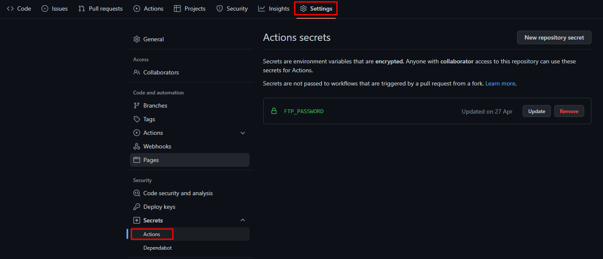
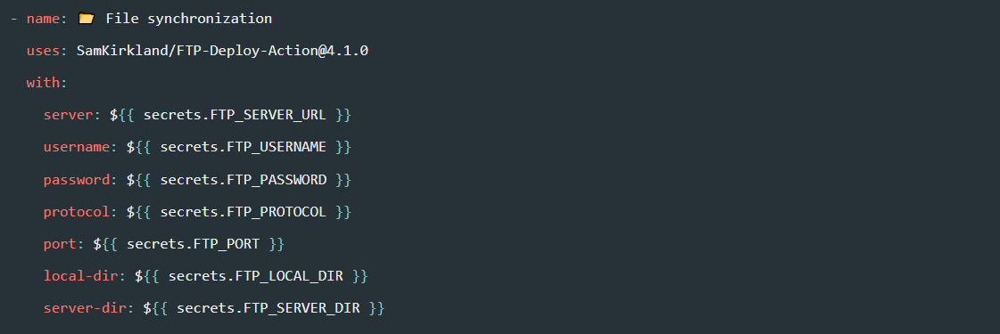

Cześć! Po trochę dłuższej urlopowej przerwie serdecznie zapraszam do kolejnego wpisu na blogu. Dziś dość krótki ale za to ciekawy i praktyczny temat. Opiszę kolejną funkcjonalność pochodzącą z platformy GitHub, mianowicie **GitHub Secrets**. Zapraszam do czytania!

## GitHub Secrets - teoria

Standardowo na początku trochę teorii. Przechowywanie wrażliwych danych zawsze było problematyczne. Hasła do FTP, klucze API, login i hasła wymagane do autoryzacji - te dane nie powinny znaleźć się w niepowołanych rękach. Temat bezpieczeństwa danych występuje praktycznie w każdym projekcie, dlatego platforma GitHub świetnie zauważyła potrzebę przechowywania w bezpiecznym miejscu ważnych danych. I tak właśnie powstał [GitHub Secrets](https://docs.github.com/en/actions/security-guides/encrypted-secrets). GitHub Secrets to po prostu zaszyfrowane zmienne, których możemy używać w plikach z definicjami workflows w GitHub Actions - czym są GitHub Actions już kiedyś opisywałem na blogu, więc [odsyłam do artykułu na ten temat](https://homeverest.pl/github-actions/).

Co jest warte uwagi, to fakt, że dostęp do zmiennych z sekretami mają wszyscy członkowie, którzy są dodani do projektu, jednak nikt nie ma możliwości zobaczenia co zawiera sekret, zawartość ta jest pobierana tylko i wyłącznie w momencie uruchomienia zdefiniowanego wcześniej workflow. Nie ma niestety możliwości, aby w tworzonym oprogramowaniu wykorzystywać sekrety, GitHub Secretes są wykorzystywane tylko przez GitHub Actions.

## GitHub Secrets - praktyka

Po dawce wiedzy teoretycznej teraz czas na wykorzystanie jej w praktyce. Przedstawię jak dodać własne sekrety na platformie GitHub.

Po zalogowaniu się do GitHuba wchodzimy w projekt, w którym chcemy wykorzystać sekrety. Następnie wchodzimy w jego ustawienia i w zakładce "_Secrets_" klikamy w pozycję "_Actions_". Poniżej screen z przykładowego projektu, w którym zdefiniowałem nowy sekret o nazwie "_FTP\_PASSWORD_".



Jak widać nie ma opcji, aby podejrzeć sekret, możemy go ewentualnie zaktualizować lub usunąć. W celu dodania nowego sekretu należy kliknąć w przycisk "_New repository secret_", wtedy wyświetli nam się prosty formularz, w którym uzupełnimy zawartość sekretu:


Skoro wiadomo gdzie można zobaczyć istniejące sekrety oraz jak je dodawać, przychodzi kolej na wykorzystanie ich w praktyce. Do tego celu posłużę się istniejącym plikiem workflow, który służy mi do kopiowania plików z nową wersją aplikacji na serwer FTP - jeśli czytałeś mój artykuł o [GitHub Actions](https://homeverest.pl/github-actions/) to pewnie kojarzysz o co tam chodziło dokładnie. Nie trzeba jednak przeczytać tego artykułu, żeby zrozumieć jak wykorzystać sekrety.



Banalny przykład wykorzystania GitHub Secrets w workflow. Do parametrów jakie nasze workflow potrzebuje np. do zalogowania się na serwerze FTP, przekazujemy utworzone wcześniej sekrety. Najważniejsza jest konwencja w jakiej przekazujemy sekret. Musimy zawsze wpisywać je w podwójnych "wąsach" i używać do tego celu kontekstu "_secrets_", po kropce podajemy nazwę naszego sekretu.

```yaml
${{ secrets.NAZWA_SEKRETU }}
```

Tyle. Zachęcam to wypróbowania sekretów w waszych projektach.

## GitHub Secrets - podsumowanie

To tyle w tym temacie. Dzięki za przeczytanie tego wpisu. Będę również bardzo wdzięczny jeżeli podzielisz się tym materiałem ze swoimi znajomymi poprzez udostępnienie na LinkedIn lub w innych mediach społecznościowych. Dzięki i do zobaczenia w kolejnym wpisie!
