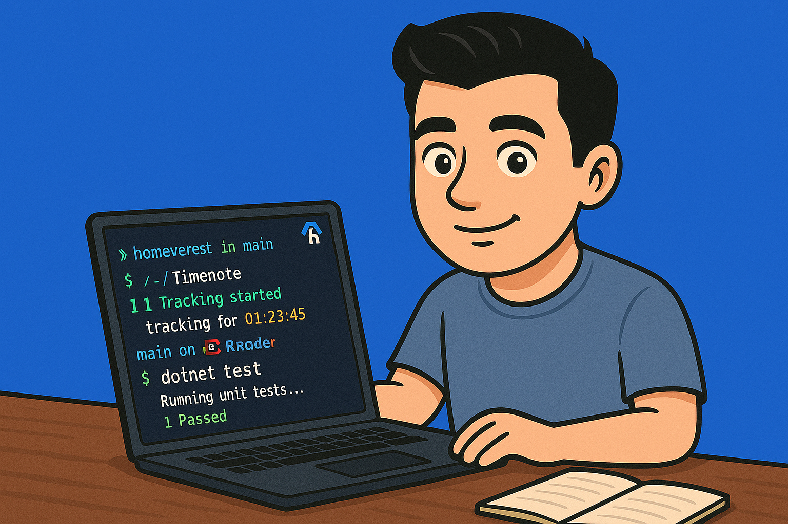
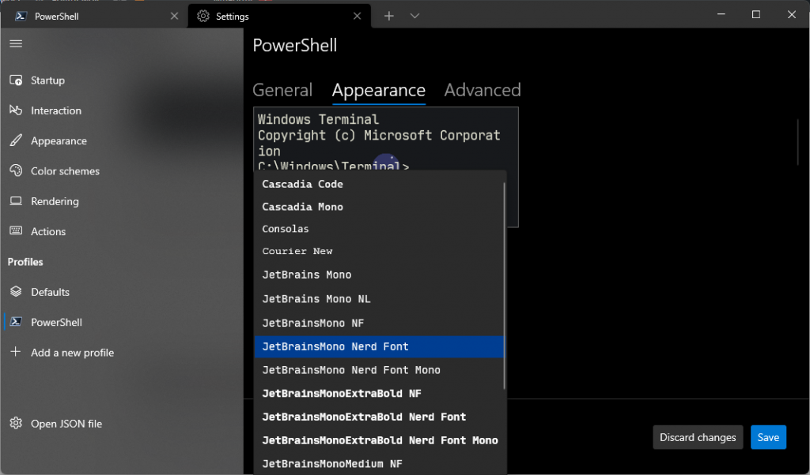
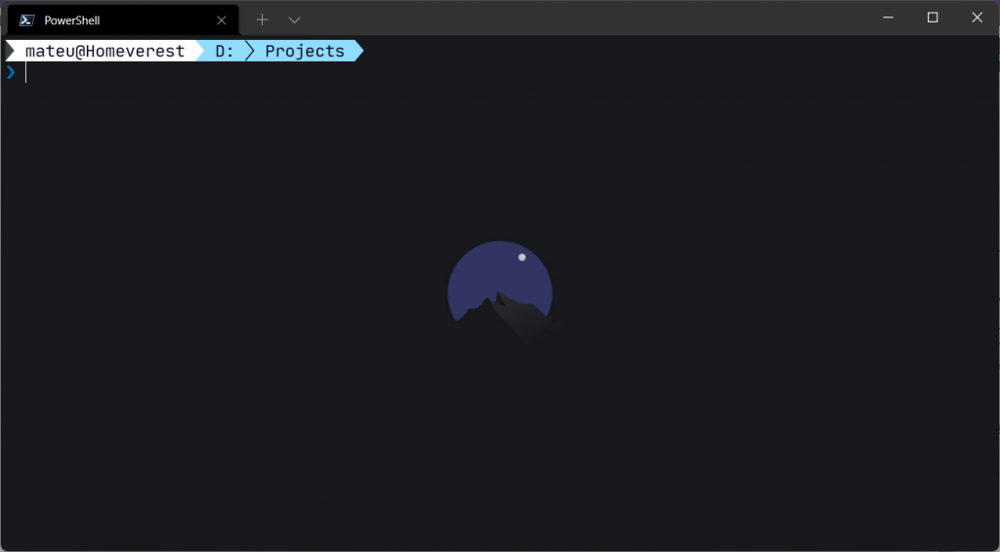
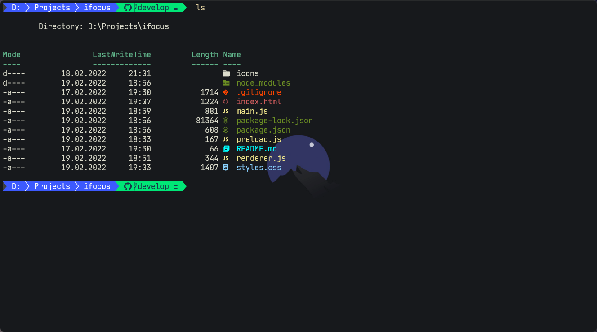

Cześć! W tym artykule pokaże wam w jaki sposób zacząć korzystać z graficznej nakładki na konsolę Power Shell, czyli modułu Oh My Posh. Jeśli korzystacie z terminala w swojej codziennej pracy zdecydowanie polecam zainstalowanie Oh My Posh, dzięki temu korzystanie z niego zacznie być bardziej wygodne i przyjemne. Ja osobiście korzystałem z desktopowych aplikacji do Gita i przeniosłem się do terminala właśnie dzięki modułowi Oh My Posh.

W artykule znajdziecie informacje jak krok po kroku zainstalować moduł Oh My Posh w Windows Terminal a także polecę wam ciekawe dodatki, które usprawnią pracę z Gitem oraz zmienią kolory wyświetlą graficzne ikonki plików i katalogów w terminalu.

## Zaczynamy! Co będzie potrzebne?

Zanim przejdziemy do właściwej instalacji należy przygotować środowisko, po to aby wszystko działało tak jak należy. Należy wykonać kilka kroków przed właściwą instalacją Oh My Posh.

### PowerShell

Niezbędny do zainstalowania modułu Oh My Posh. Ważną zaletą PowerShella jest jego wieloplatformowość, dlatego użytkownicy korzystający z Linuxa lub macOSa również będą mogli zainstalować moduł Oh My Posh. PowerShella najlepiej pobierać bezpośrednio ze źródła, czyli oficjalnego [repozytorium na githubie](https://github.com/PowerShell/PowerShell#get-powershell).

### Windows Terminal

**Nie jest wymagany** lecz zdecydowanie polecam go zainstalować. Windows terminal umożliwia uruchamianie kilku powłok skryptowych, umożliwia dzielenie okna na kilka paneli, oraz ma bardzo duże możliwości dostosowania wyglądu pod preferencje użytkownika. Windows Terminal znajdziemy w [Windows Store](https://www.microsoft.com/store/productId/9N0DX20HK701), skąd możemy zainstalować go bezpośrednio w swoim systemie.

### Nerd fonts

Oh My Posh do właściwego wyświetlania tekstu oraz ikon wymaga w systemie zainstalowanej odpowiedniej czcionki. Czcionki te znajdziemy na [www.nerdfonts.com](https://www.nerdfonts.com/). Osobiście polecam czcionkę [JetBrainsMono Nerd Font](https://github.com/ryanoasis/nerd-fonts/releases/download/v2.1.0/JetBrainsMono.zip) - jeśli kojarzycie takie IDE jak JetBrains Rider to tam właśnie wykorzystywana jest ta czcionka. Wybór oczywiście zależy od własnych preferencji z tym, że należy pamiętać aby pobrać ją z Nerd Fonts.

## Mamy wszystko, instalujemy Oh My Posh!

Zaczynamy od uruchomienia PowerShella - tutaj zależy od użytkownika czy będzie uruchamiał go w Windows Terminal czy też bezpośrednio. Poniżej będę pokazywał wszystkie kroki z wykorzystaniem Windows Terminal.



Rozpoczynamy od ustawienia czcionki - jak wspominałem wcześniej ja korzystam z **JetBrainsMono Nerd Font**. W zależności od tego jaka czcionka została pobrana ze strony Nerd Fonts, należy ją znaleźć i wybrać w polu **_Font Face_** w oknie ustawień Windows Terminal. Czcionkę ustawiamy od razu ponieważ, w późniejszych krokach wyświetlane będą elementy, które bez odpowiednio ustawionej czcionki będą wyświetlać się jako "krzaczki".

Możemy przystąpić do zainstalowania modułu Oh My Posh. W oknie PowerShella uruchamiamy poniższą komendę, a następnie zatwierdzamy instalację modułu.

```powershell
Install-Module oh-my-posh -Scope CurrentUser
```

Moduł Oh My Posh zainstalowany! Teraz utworzymy plik profilu PowerShella, w którym znajdować będą się komendy, które wykonywane będą przy każdym uruchomieniu powłoki PowerShell. Jeżeli plik profilu PowerShella nigdy nie był tworzony, to notatnik wyświetli komunikat, że takiego pliku nie ma i zapyta czy go utworzyć.

```powershell
notepad $PROFILE
```

W oknie notatnika wklejamy następujące dwie linijki:

```powershell
Import-Module oh-my-posh
Set-PoshPrompt -Theme paradox
```

Pierwsza gwarantuje, że przy każdym uruchomieniu PowerShella moduł Oh My Posh będzie importowany, druga ustawia motyw konsoli. Listę motywów można zobaczyć na [oficjalnej stronie](https://ohmyposh.dev/docs/themes). Po zapisaniu komend w pliku profilu PowerShell należy przeładować profil. Możemy to zrobić standardowo poprzez ponowne uruchomienie Windows Terminala lub wpisując komendę:

```powershell
. $PROFILE
```

W tym momencie naszym oczom ukaże się świetnie wyglądająca konsola!



W zasadzie to już wszystko. Warto wspomnieć tutaj, że motywy możemy dowolnie edytować i dostosowywać do swoich upodobań. Poniżej znajduje się opis w jaki sposób to zrobić. Należy zwrócić uwagę na to, że na powyższym screenie widać fajne tło - ono nie jest instalowane wraz z modułem Oh My Posh - ustawienie własnego obrazka w tle lub ogólnie ustawienia okna, można zmienić w ustawieniach Windows Terminala. Dlatego zachęcam do korzystania z tej aplikacji, ponieważ daje bardzo duże możliwości konfiguracji.

Warto wspomnieć, że w tym momencie możesz wykonać następującą komendę:

```powershell
Get-PoshThemes
```

Wyświetli ona wszystkie zainstalowane motywy wraz z własnymi, które znajdują się w katalogu z motywami Oh My Posh. Można podejrzeć, jak dany motyw się prezentuje w obecnej lokalizacji w jakiego uruchomiliśmy komendę.

## Ustawianie własnego motywu

W oknie PowerShella wpisujemy następującą komendę:

```powershell
Export-PoshTheme -FilePath "~/.my-theme.omp.json" -Format json
```

Spowoduje to wyeksportowanie aktualnie używanego motywu do nowego pliku, który można edytować. Możemy to zrobić w dowolnym edytorze, należy pamiętać tylko, żeby rozszerzenie pliku z motywem miało końcówkę **.omp.json**.

Wyeksportowanie motywu do nowego pliku to nie wszystko co należy zrobić aby móc z niego korzystać. Nowy własny motyw należy przenieść do odpowiedniego katalogu - takiego, w którym znajdują się pozostałe motywy Oh My Posh. Domyślnie jest to ścieżka w dokumentach użytkownika, np.

```
C:\Users\mlysien\.oh-my-posh\themes
```

Po wklejeniu pliku z nowym motywem do katalogu z motywami Oh My Posh należy w analogiczny sposób jak robiliśmy wcześniej zaimportować nasz nowy motyw przy starcie PowerShella, czyli otwieramy plik profilu:

```powershell
notepad $PROFILE
```

Następnie w ostatniej linijce aktualizujemy nazwę motywu wpisując nazwę pliku z naszym motywem, czyli jeśli zapisaliśmy nasz motyw jako **my-theme.omp.json**, to w plik powinien wyglądać w ten sposób:

```powershell
Import-Module oh-my-posh
Set-PoshPrompt -Theme my-theme
```

Zapisujemy, przeładowujemy profil (lub po prostu uruchamiamy ponownie PowerShella) i od tego momentu cieszymy się własnym wyglądem konsoli. Warto dodać, że w tym momencie każda zmiana w pliku z motywem będzie od razu widoczna, nie będzie trzeba od nowa przeładowywać profilu lub robić innych rzeczy. Po prostu po zapisaniu pliku motywu w konsoli od razu będzie widoczna zmiana.

### Struktura pliku motywu

Nie chcę się tutaj rozpisywać na ten temat, bo jest dość obszerny, dlatego odsyłam do [dokumentacji modułu Oh My Posh](https://ohmyposh.dev/docs/config-overview). Znajduje się tam obszerne wyjaśnienie w jaki sposób można dostosować motyw pod siebie. Możliwości jest naprawdę dużo. Sama struktura pliku to zwykły json, składa się z bloków, które z kolei zawierają segmenty - czyli w tym wypadku elementy składowe zawartość konsoli, np. aktualną ścieżkę, poziom baterii, lub informacje o systemie. Segmenty są łączone jeden po drugim, dzięki czemu możemy wyświetlać kilka informacji naraz.

## Dodatki do konsoli

Temat instalacji i konfiguracji modułu Oh My Posh został już wyjaśniony. Na koniec w ramach małego dodatku pokażę jeszcze dwa moduły ułatwiające korzystanie z konsoli.

### terminal-icons

Moduł z zestawem ikonek, które wyświetlają się w terminalu. Moduł ten jest bardzo rozbudowany i ciągle aktualizowany - odsyłam do [oficjalnego repozytorium](https://github.com/devblackops/Terminal-Icons). Rozpoznaje rozszerzenia wszystkich najpopularniejszych typów plików, np. .json, .js, .cs i wyświetla je w ładnej dla oka ikonce.

Instalacja modułu przebiega analogicznie do instalacji Oh My Posh i w sumie każdego modułu do PowerShella:

```powershell
Install-Module -Name Terminal-Icons -Repository PSGallery
```

Następnie, na samym końcu pliku profilu PowerShell dodajemy linijkę:

```powershell
Import-Module -Name Terminal-Icons
```

### posh-git

Bardzo przydatny moduł dla wszystkich tych, którzy korzystają z gita. Integruje Gita z konsolą PowerShell i dostarcza informacje na temat stanu repozytorium, czyli, czy jakieś pliki zostały zmodyfikowane, czy jest coś do wysłania na serwer, itp. Ponadto dostarcza podpowiedzi dla komend gita, czyli po wpisaniu kilku literek komendy i naciśnięciu klawisza **Tab** komendy będą automatycznie uzupełnione, przez co zaoszczędzamy na pisaniu. Odsyłam do [oficjalnego repozytorium](https://github.com/dahlbyk/posh-git).

Instalacja modułu, standardowo:

```powershell
Install-Module -Name posh-git -Scope CurrentUser -Force
```

I oczywiście na końcu pliku dodajemy linijkę, która gwarantuje, że moduł będzie importowany przy każdym uruchomieniu PowerShella:

```powershell
Import-Module -Name posh-git
```



## Podsumowanie

Konsola wcale nie musi być czarno-biała! Mam nadzieję, że ten artykuł również zmienił wasz sposób patrzenia na konsole. Moduł Oh My Posh spowodował, że korzystanie z konsoli w codziennej pracy stało się dla mnie przyjemnością. Mam nadzieję, że instrukcje, jakie przedstawiłem w tym artykule były jasne i że wszystko działa jak należy. Jeśli uważasz, że przekazana tutaj wiedza może być przydatna dla kogoś innego to śmiało się nią podziel, przy użyciu jednego z przycisków poniżej. Dzięki! Do następnego artykułu!
