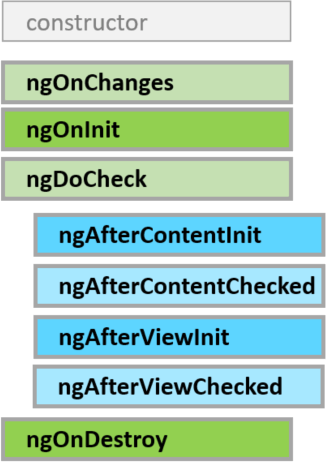

Cześć! Nowy rok zaczynam wpisem trochę innym niż te z poprzedniego, pierwszy raz będzie to wpis poświęcony technologii frontendowej. Opowiem trochę o Angularze i o tym w jaki sposób działają komponenty. W projekcie jakim znajduję się obecnie wykorzystujemy Angulara, więc stał się on mi dość bliskim frameworkiem, dlatego zapraszam do zapoznania się z artykułem.

## Cykl życia komponentu

W Angularze istnieje **aż 8 interfejsów** opisujących cykl życia komponentu. Każdy interfejs dostarcza metodę, która wywoływana jest w odpowiednim dla siebie momencie, np. przy tworzeniu komponentu, przy zmianie stanu lub w momencie gdy komponent jest niszczony. Co ciekawe tworząc nasze komponenty wcale nie musimy dbać o obsługę tych zdarzeń, choć domyślnie pewnie każdy korzysta z interfejsu `OnInit`. Wszystkie dostępne interfejsy przedstawiam poniżej wraz z krótkim opisem i co ważne w kolejności w jakiej się wywołują.



**`OnChanges`** \- interfejs dostarcza metody `ngOnChanges`, która wywołuje się jako pierwsza jeszcze przed `ngOnInit`. Metoda wywołuje się tylko w przypadku jeśli komponent posiada na swoich wewnętrznych polach dekorator `@Input`, który wykorzystywany jest do komunikacji komponentu z podrzędnymi komponentami (dziećmi).

`**OnInit**`\- interfejs dostarcza metodę `ngOnInit`, która wywołuje się zaraz po inicjalizacji komponentu, czyli zaraz po wywołaniu konstruktora. Przydatna w momencie kiedy chcemy przypisać jakieś początkowe wartości do wcześniej zainicjalizowanych obiektów i ustawić komponent w odpowiednim stanie, np. z wykorzystaniem serwisów, konstruktor służy zwykle do zdefiniowania zależności jakie posiada komponent, a w `ngOnInit` można z tych zależności skorzystać do pobrania potrzebnych danych.

**`DoCheck`** \- interfejs dostarcza metodę `ngDoCheck`, która wywoływana jest zawsze jeśli w naszym komponencie zostanie zmieniony jakikolwiek zbindowany element (nie tylko z dekoratorem `@Input`). Wykorzystywanie tego interfejsu jest przydatne kiedy chcemy mieć kontrolę nad elementami które się zmieniają i w jakiś sposób na te zmiany zareagować.

**`AfterContentInit`** \- interfejs dostarcza metodę `ngAfterContentInit`, która to metoda wywoływana jest w momencie kiedy komponent zostanie w całości załadowany wraz ze wszystkimi podrzędnymi komponentami które zawiera.

**`AfterContentChecked`** \- interfejs dostarcza metodę `ngAfterContentChecked`, która uruchamia się zawsze po `ngDoCheck` i sprawdza czy któryś komponent (dziecko) z zawartych wewnątrz naszego komponentu zmienił swój stan, chodzi tutaj o zmianę stanu `<ng-content>`.

**`AfterViewInit`** \- interfejs dostarcza metodę `` ng`AfterViewInit` ``, która wywoływana jest zawsze raz po metodzie `ngAfterContentChecked`. Wywoływana jest w momencie kiedy komponent zostanie w całości wyrenderowany wraz ze wszystkimi komponentami które zawiera, czyli po prostu jego szablon i szablony jego dzieci zostaną wyświetlone na ekranie.

**`AfterViewChecked`** \- interfejs dostarcza metodę `ngAfterViewChecked`, która wywoływana jest za każdym razem kiedy zmieni się stan szablonu komponentu podrzędnego (dziecka).

**`OnDestroy`** \- interfejs dostarcza metodę `ngOnDestroy`, która wywoływana jest przed zniszczeniem komponentu. Interfejs bardzo przydatny, kiedy chcemy trochę wyczyścić zasoby jakie komponent zajął, najlepiej sprawdza się tutaj odsubskrybowanie się z obserwowalnych zasobów danych.

Poniżej zamieszczam przykładowy komponent, który implementuje wszystkie wyżej wymienione interfejsy z cyklu życia komponentu i wyświetla w konsoli, kiedy zostały wywołane.

```ts
export class AppComponent implements OnInit, OnChanges, DoCheck, AfterContentInit, 
  AfterContentChecked, AfterViewInit, AfterViewChecked, OnDestroy {
    
  constructor() {
    console.info("constructor invoked");
  }
  ngOnChanges(changes: SimpleChanges): void {
    console.log("ngOnChanges invoked");
    console.log(changes);
  }
  ngOnInit(): void {
    console.log("ngOnInit invoked");
  }
  ngDoCheck(): void {
    console.log("ngDoCheck invoked");
  }
  ngAfterContentInit(): void {
    console.log("ngAfterContentInit invoked");
  }
  ngAfterContentChecked(): void {
    console.log("ngAfterContentChecked invoked");
  }
  ngAfterViewInit(): void {
    console.log("ngAfterViewInit invoked");
  }
  ngAfterViewChecked(): void {
    console.log("ngAfterViewChecked invoked");
  }
  ngOnDestroy(): void {
    console.log("ngOnDestroy invoked");
  }
}
```


Szczegółowe informacje o cyklu życia komponentu znajdziecie u źródła, czyli w oficjalnej dokumentacji Angulara, [tutaj link](https://angular.io/guide/lifecycle-hooks#responding-to-lifecycle-events).

## Podsumowanie

Dzięki za poświęcenie czasu na przeczytanie artykułu, chciałem pokazać, że cykl życia komponentów w Angularze nie ogranicza się tylko do `ngOnInit`. Implementacja wszystkich interfejsów daje sporo możliwości do jeszcze większego kontrolowania stanu komponentu i reagowania na wszelkie zmiany jakie w nim zachodzą, ale nie tylko w nim samym a także w jego komponentach podrzędnych. Dziękuję jeszcze raz za przeczytanie tego wpisu. Będę również bardzo wdzięczny jeżeli podzielisz się tym materiałem ze swoimi znajomymi poprzez udostępnienie na LinkedIn lub w innych mediach społecznościowych. Dzięki!
