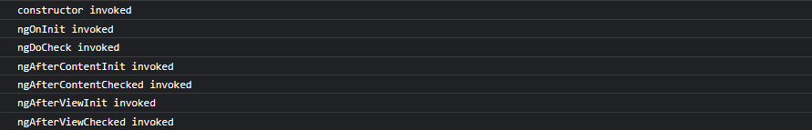

Cześć! W tym artykule przedstawię zagadnienie związane z zarządzaniem cyklem życia obiektów w kontenerze IoC. Kontener IoC wykorzystywany jest to odwrócenia sterowania w aplikacji - zgodnie z paradygmatem Inverse of Control (stąd IoC), przez co możliwa jest zmiana kontrolowania tworzenia obiektów z ręcznego tworzenia instancji na wykorzystanie abstrakcji (poprzez interfejsy) i wstrzykiwanie tych abstrakcji do obiektów, które ich potrzebują. Kontener IoC umożliwia przechowywanie obiektów i zarządzanie ich cyklem życia poprzez tworzenie nowych instancji lub zwracaniu istniejących przez co zwalnia programistów z ręcznego ich tworzenia. W tym artykule przedstawię jakie są możliwe sposoby na zarządzanie obiektami. Zapraszam do lektury.

## Wstęp

W wytłumaczeniu jak działają poszczególne cykle życia obiektów w kontenerze IoC najlepiej posłużyć się jakimś przykładem, tak też zrobię, poniżej zamieszczam interfejs oraz implementacje prostego serwisu do generowania haseł.

```csharp
internal interface ISecretService
{
    string Generate(string secret);
}

internal class SecretService : ISecretService
{
    protected Guid Hash { get; } = Guid.NewGuid();
    
    public string Generate(string password)
    {
        return $"{Hash}-{password}";
    }
}
```

`ISecretService` zawiera jedną metodę generującą hasło na podstawie przekazanego sekretu. Powiedzmy, że gdzieś w aplikacji chcemy mieć własną implementację takiego serwisu - tą implementacją jest klasa `SecretService` która posiada wewnątrz siebie pole `Hash` które generuje randomowy Guid.

## Cykl życia obiektu - Singleton

Rejestrują nasz serwis `ISecretService` jako Singleton sprawiamy, że będzie on posiadał dokładnie tylko jedną instancje podczas całego cyklu działania aplikacji. Każde nowe żądanie, które będzie próbować dostać coś z serwisu będzie opierać się ciągle o tą samą instancje, czyli kontener IoC wewnątrz siebie będzie posiadał ciągle jedną instancje i ją zwracał do każdego obiektu który będzie chciał jej użyć.

```csharp
    [SetUp]
    public void Setup()
    {
        _serviceCollection = new ServiceCollection();
        _serviceCollection.AddSingleton<ISecretService, SecretService>();
        _serviceProvider = _serviceCollection.BuildServiceProvider();
    }
```

W celu zaprezentowania jak działa cykl życia Singleton wykorzystam prosty unit test. W metodzie `Setup` tworzymy nasz obiekt `ServiceCollection`. Obiekt ten jest wykorzystywany do przechowywania zarejestrowanych serwisów i obiektów, dlatego rejestrujemy w nim nasz `ISecretService` jako cykl życia obiektu Singleton. Na końcu pobieramy wszystkie providery, czyli klasy które zawierają implementacje zarejestrowanych serwisów. Poniżej unit test prezentujący działanie Singletona.

```csharp
    [Test]
    public void LifeCyclesTest()
    {
        // arrange
        var secret = "my-secret";
        var secretService1 = _serviceProvider.GetService<ISecretService>();
        var secretService2 = _serviceProvider.GetService<ISecretService>();
        
        // act
        var secret1 = secretService1.Generate(secret);
        var secret2 = secretService2.Generate(secret);
        
        // assert
        Assert.That(secretService1, Is.SameAs(secretService2));
        Assert.That(secret1, Is.EqualTo(secret2));
    }
```

W teście symulujemy próbę utworzenia dwóch instancji `ISecretService`. Następnie wywołujemy metodę do generowania hasła na dwóch utworzonych obiektach i na koniec sprawdzamy, czy Singleton działa zgodnie ze swoimi założeniami - jedna instancja obiektu działająca podczas cyklu życia aplikacji zwraca dokładnie to samo dla każdego wywołania serwisu.



Gdy zdebugujemy test jednostkowy zobaczymy, że zarejestrowany serwis jako Singleton działa dokładnie tak jak powinien, mimo iż utworzyliśmy dwie instancje serwisu, to kontener IoC zwrócił do nich referencję do pojedynczej instancji, dlatego wywołując metodę do generowania hasła dla każdego obiektu osobno i tak otrzymujemy takie samo hasło a same instancje są takie same. Test przechodzi więc jedziemy dalej.

## Cykl życia obiektu - Transient

Z kolei rejestrują nasz serwis `ISecretService` jako Transient sprawiamy, że za każdym nowym wywołaniem serwisu, nasz kontener IoC będzie zwracał nową instancję obiektu. Poniżej unit test pokazujący jak działa cykl życia obiektów Transient.

```csharp
    [SetUp]
    public void Setup()
    {
        _serviceCollection = new ServiceCollection();
        _serviceCollection.AddTransient<ISecretService, SecretService>();
        _serviceProvider = _serviceCollection.BuildServiceProvider();
    }

    [Test]
    public void LifeCyclesTest()
    {
        // arrange
        var secret = "my-secret";
        var secretService1 = _serviceProvider.GetService<ISecretService>();
        var secretService2 = _serviceProvider.GetService<ISecretService>();
        
        // act
        var secret1 = secretService1.Generate(secret);
        var secret2 = secretService2.Generate(secret);
        
        // assert
        Assert.That(secretService1, Is.Not.SameAs(secretService2));
        Assert.That(secret1, Is.Not.EqualTo(secret2));
    }
```

W porównaniu do testu jednostkowego dla Singletona, zmienia się tutaj to, że rejestrujemy do kontenera IoC serwis `ISecureService` jako Transient. Pobieramy dwie instancje serwisu i zapisujemy je do dwóch obiektów i wywołujemy generowanie hasła. Cykl życia Transient sprawia, że kontener IoC zwraca za każdym razem nową instancję, dlatego też upewniamy się że dwa obiekty serwisu są różne i wygenerowane hasła również się od siebie różnią. Poniżej screen z debugu. Zielony test więc przechodzimy do Scoped.


## Cykl życia obiektów - Scoped

To chyba najbardziej powszechnie stosowany cykl życia obiektów, szczególnie jeśli chodzi o framework ASP .NET Core, ponieważ tutaj żądaniami do wywołania serwisów są zwykle requesty HTTP. To idealne podejście do zastosowania cyklu życia obiektu Scoped. Każdy wywołanie HTTP tworzy w aplikacji pojedynczy scope i teraz stosując cykl życia obiektu Scoped, kontener IoC będzie zwracał w ramach pojedynczego żądania HTTP (pojedynczy scope) tą samą instancję zarejestrowanego serwisu - czyli będzie się zachowywał dokładnie tak jak Singleton. Natomiast gdy żądanie się skończy, tym samy kończy się scope, przy kolejnym wywołaniu kontener IoC zwróci nowy obiekt serwisu - czyli będzie działał jak Transient. Poniżej test jednostkowy.

```csharp
    [SetUp]
    public void Setup()
    {
        _serviceCollection = new ServiceCollection();
        _serviceCollection.AddScoped<ISecretService, SecretService>();
        _serviceProvider = _serviceCollection.BuildServiceProvider();
    }

    [Test]
    public void LifeCyclesTest()
    {
        // arrange
        var secret = "my-secret";
        ISecretService secretServiceScope1 = null;
        ISecretService secretServiceScope2 = null;
        
        using (var scope = _serviceProvider.CreateScope())
        {
            // act
            var secretService1 = scope.ServiceProvider.GetService<ISecretService>();
            var secretService2 = scope.ServiceProvider.GetService<ISecretService>();
            
            secretServiceScope1 = scope.ServiceProvider.GetService<ISecretService>();

            var secret1 = secretService1.Generate(secret);
            var secret2 = secretService2.Generate(secret);
            
            // assert
            Assert.That(secretService1, Is.SameAs(secretService2));
            Assert.That(secret1, Is.EqualTo(secret2));
        }
        
        using (var scope = _serviceProvider.CreateScope())
        {
            // act
            var secretService1 = scope.ServiceProvider.GetService<ISecretService>();
            var secretService2 = scope.ServiceProvider.GetService<ISecretService>();
            
            secretServiceScope2 = scope.ServiceProvider.GetService<ISecretService>();
            
            var secret1 = secretService1.Generate(secret);
            var secret2 = secretService2.Generate(secret);
            
            // assert
            Assert.That(secretService1, Is.SameAs(secretService2));
            Assert.That(secret1, Is.EqualTo(secret2));
        }
        
        // assert
        Assert.That(secretServiceScope1, Is.Not.SameAs(secretServiceScope2));
    }
```

Dużo się tutaj dzieje, ale sprawa tak naprawdę jest bardzo prosta. W powyższym teście są dwa scopy - czyli tak jakby dwa requesty HTTP. W ramach pojedynczego scope'a nasz serwis będzie zwracany jakby był Singletonem, stąd sprawdzenie czy rzeczywiście tak jest. Natomiast mimo iż nasz serwis wygeneruje te same hasła w obrębie jednego scope'a to w drugim wywołaniu (drugim scope'ie) hasła będą nadal takie same ale będą różne niż w tym pierwszym - czyli tak jak w cyklu życia Transient, dlatego dodałem tutaj jeszcze dwie zmienne, każda z nich będzie odbierać obiekt serwisu w osobnym scope'ie - no i jak się można przekonać faktycznie zmienne są różne od siebie, czyli zgodnie z tym jak działa tryb Transient.


## Podsumowanie

Trochę tego było w tym artykule, dzięki za przeczytanie. Rejestrowanie i wstrzykiwanie obiektów, korzystanie z abstrakcji stało się teraz chlebem powszednim programistów, fajnie wiedzieć jaki wpływ na istnienie obiektów mają wykorzystywane przez nas cykle życia. Czy warto wszystko rejestrować jak Scoped? A może czasem warto wykorzystać Singleton'a? Mam nadzieje, że artykuł spowoduje taką chwilkę refleksji. Na koniec chciałbym polecić bardzo fajny materiał z kanału DevMentors - [tutaj link](https://www.youtube.com/watch?v=nx7PPzhx2tA), gdzie znajdziecie jeszcze więcej informacji o cyklach życia obiektów w kontenerze IoC i ogólnie masę interesujących filmów.

Będę również bardzo wdzięczny, jeżeli podzielisz się tym materiałem ze swoimi znajomymi poprzez udostępnienie na LinkedIn lub w innych mediach społecznościowych. Dzięki!
