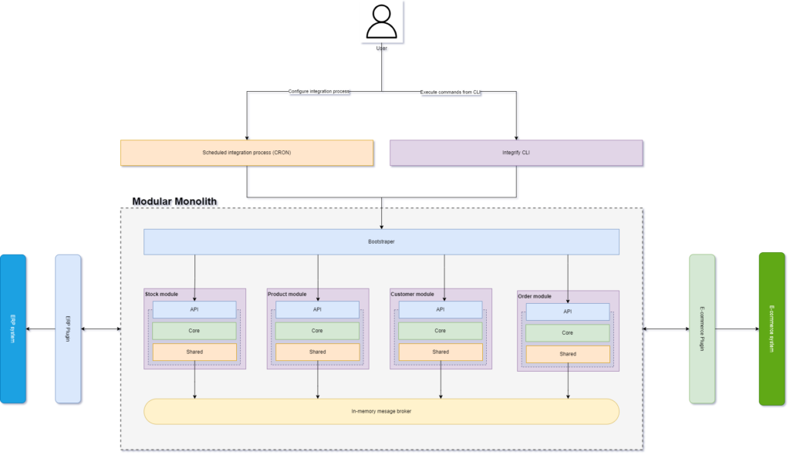
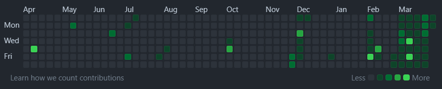
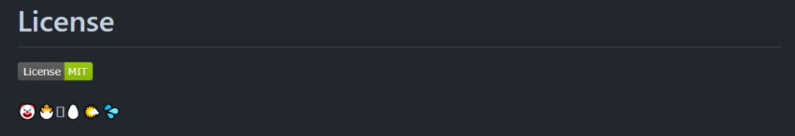

Zastanawiałem się mocno, czy aby na pewno to dobry pomysł, żeby publikować wpis na temat mojego udziału w konkursie 100commitow. Co jeśli za chwilę odpadnę? No cóż, najwyżej za miesiąc będę się tłumaczył dlaczego mi nie wyszło. Postanowiłem to zrobić więc oto mój projekt na 100comitow - [Integrify](https://github.com/mlysien/integrify).

## 100commitow - co to jest?

Na początek może coś o samym konkursie. 100commitow to konkurs realizowany przez chłopaków z [DevMentors](https://devmentors.io/). Rozpoczął się początkiem marca tego roku i potrwa do 8-go czerwca. Sprawa jest prosta, trzeba wymyślić projekt i codziennie zrobić przynajmniej jeden commit. Projekt musi być na platformie GitHub oraz musi być publiczny. Nie dodasz commita - odpadasz (co prawda jest jeden "joker", więc raz można przysnąć). Więcej informacji można znaleźć na [stronie konkursu](https://100commitow.pl/).

Według mnie świetna inicjatywa. Dzięki temu konkursowi można rozbudować swój profil na GitHubie o ciekawy projekt open source, który może być świetną wizytówką i potwierdzeniem naszych umiejętności. Może też przydać się innym. A może znajdzie się ktoś kto będzie chciał z nami rozbudować ten projekt? Posiadanie takiego projektu open source daje duże możliwości. Jednak żeby nie było tak kolorowo to, aby to wszystko mogło mieć miejsce potrzeba jest motywacja, a ją niestety jest bardzo łatwo stracić. Konkurs rozpoczęło **466 uczestników**. Dziś (01.04.2024) pozostało **255**. W ciągu miesiąca **211** osób rozpoczęło projekt i przestało go rozwijać. Ja jeszcze jestem w grze. A co to za projekt przeczytasz niżej.

## Mój projekt - integrify

Zastanawiałem się długo nad formą realizowanego projektu, czy pójść bardziej w tzw. "biznesówkę", czyli jakąś wymyśloną aplikację, która mogłaby realizować jakieś założenia biznesowe. Czy też pójść bardziej w stronę tworzenia narzędzia/infrastruktury. Przypomniało mi się, że kiedyś chciałem stworzyć aplikację do integrowania zamówień ze sklepu e-commerce do systemu ERP. Aplikacja będzie pełnić rolę takiej właśnie infrastruktury pomiędzy sklepem a systemem ERP. Wtedy zabrakło mi chęci do działania. Teraz nadarzyła się idealna okazja, aby móc to zrealizować.

### Integrify - must have

Integrify (taka fancy nazwa) ma być aplikacją do synchronizacji różnych obszarów pomiędzy sklepem e-commerce a systemem ERP. Główne obszary synchronizacji to:

- Synchronizacja zamówień
- Synchronizacja produktów
- Synchronizacja stanów magazynowych
- Synchronizacja klientów

Synchronizacja mogłaby się odbywać w różnych kierunkach, np. synchronizacja zamówień może polegać na pobraniu zamówień ze sklepu internetowego (system e-commerce) i utworzeniu odpowiednich dokumentów w systemie ERP. Natomiast stany magazynowe mogą być pobierane z ERP i wysyłane do sklepu internetowego.

### Integrify - nice to have

Jeśli chodzi o elementy nice to have w Integrify to bardzo chciałbym - jeśli starczy czasu - utworzyć projekt służący jako CLI, dzięki któremu możliwe byłoby sterowanie procesem synchronizacji poprzez użycie komend, możliwe byłoby ustawianie sposobu synchronizacji oraz włączanie/wyłączanie modułów lub pluginów.

### Integrify - architektura

Projekt realizuje wykorzystując podejście architektoniczne jakim jest **modularny monolit**, wydaje mi się sensowne zastosowanie takiej architektury, ponieważ mogę wtedy rozwijać każdy z modułów niezależnie od pozostałych. Jedyną możliwością komunikacji pomiędzy modułami będzie wbudowany w pamięci message broker. To podejście też daje duże możliwości na skalowanie aplikacji - a to jest bardzo ważne. Chcę zrobić infrastrukturę, która będzie jak najbardziej skalowalna. Raczej nie będzie to rozwiązanie typu plug&play. Pluginy zarówno do systemu e-commerce jak i ERP powinny zostać zaimplementowane według własnego uznania, z doświadczenia wiem, że takie systemy są mocno cusomizowane. Poniżej znajdziecie grafikę prezentującą schemat koncepcyjny projektu.

Widać tutaj że aplikacja ma być podzielona na pojedyncze moduły, jednak wszystkie będą działać w ramach jednej aplikacji, czy bardziej mądrze: pojedynczego artefaktu wdrożeniowego. Chciałbym aby moduły, jeśli zajdzie taka potrzeba komunikowały się ze sobą tylko przy użyciu wewnętrznego message brokera. Sama budowa poszczególnych modułów może być dowolna dla każdego modułu, może on równie dobrze być rozwijany przez osobny zespół developerski. Widać tutaj coś co daje duże możliwości na przejście w przyszłości na mikro serwisy.

Modularny monolit ma być jak najbardziej abstrakcyjny, po to, aby była możliwość dodawania własnych implementacji własnych końcówek, którymi są Pluginy. Właśnie Pluginy będą tym elementem, który będzie najbardziej customowy. Pluginy będą posiadać implementacje pod konkretne rozwiązanie ERP czy sklepu e-commerce. To one będą pobierały i zapisywały dane w integrowanych systemach.

## Przemyślenia po pierwszym miesiącu

Pierwszy miesiąc poświęciłem na utworzenie struktury aplikacji charakterystycznej dla modularnego monolitu. Kapitalnym przykładem, z którego korzystam jest repozytorium od wspomnianych wcześniej chłopaków z Dev Mentors - [modular-framework](https://github.com/devmentors/modular-framework).

Bardzo ważny dla projektów open source jest również plik **readme** \- musi zawierać wszystkie potrzebne informacje o projekcie, np. co ten projekt właściwie realizuje, opis architektury itp. Bardzo ważne są również informacje, jak projekt uruchomić, co nie zawsze jest takie łatwe, ponieważ niejednokrotnie trzeba postawić całą infrastrukturę wymaganą przez aplikację do działania.

Praca nad projektem już trochę weszła mi w codzienną rutynę, co prawda wspieram się aplikacją, która codziennie przypomina mi o commicie, jednak nie czuję abym się do tego zmuszał. Totalnie pobiłem swój rekord commitowania, mój diagram na profilu na GitHub nigdy nie był tak zielony:

Cieszę się, bardzo również z trzech gwiazdek, które projekt otrzymał! Fajnie że inni uczestnicy również oglądają i doceniają konkurencyjne projekty. Cieszę się również z tego, że od dłuższego czasu chciałem mieć kompletny projekt na GitHubie, a teraz jest do tego świetna okazja.

Kwiecień będzie miesiącem na tzw. programistyczne mięso - będę próbował zaimplementować wszystkie wymienione w założeniach moduły oraz dalej rozwijać plik readme. Święta Wielkanocne były wielkim wyzwaniem dla codziennego commitowania, dlatego też zredukowałem swoje postępy do "świątecznych porządków pliku readme":

Zobaczymy czy za miesiąc będę miał o czym pisać. Dzięki za uwagę, jeśli masz jakieś pytania odnośnie projektu czy czegokolwiek innego to zapraszam do kontaktu. Do zobaczenia za miesiąc!

[Tu jeszcze raz link do mojego repo.](https://github.com/mlysien/integrify)
