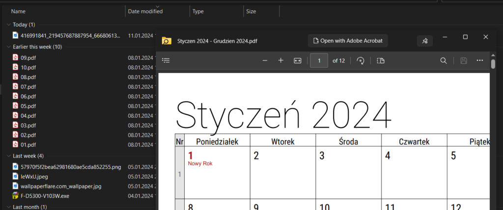
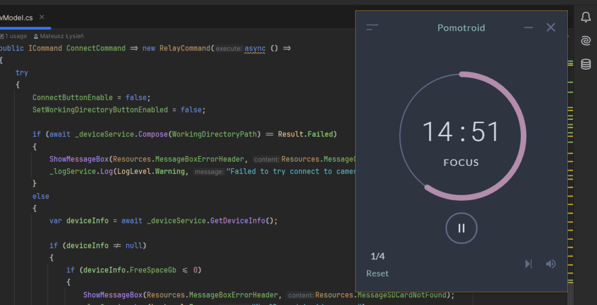
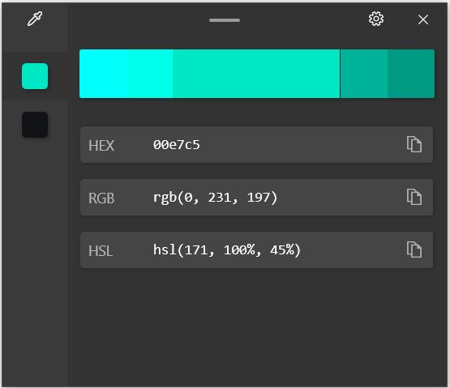
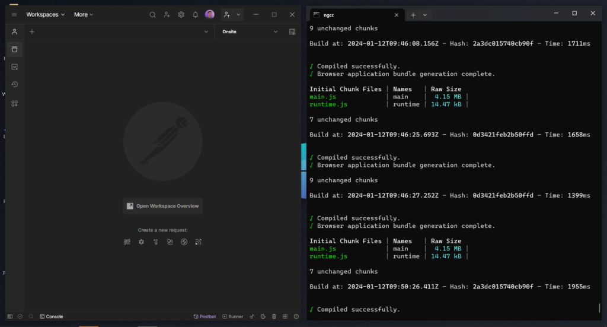
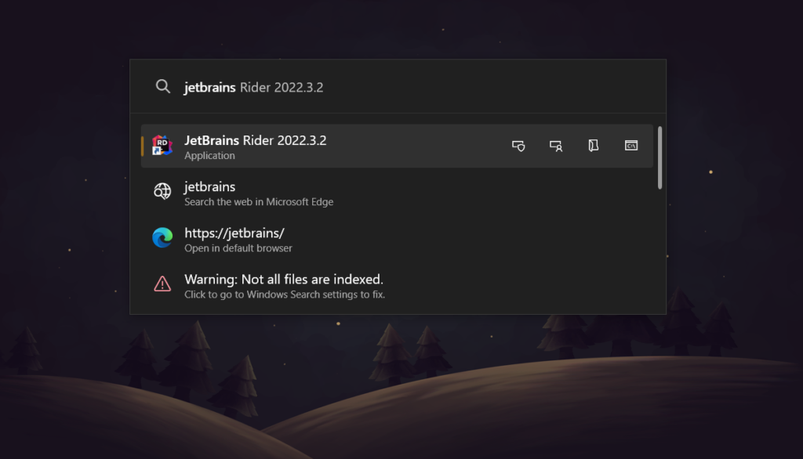

Na początek wszystkiego dobrego w nowym roku! Ten rok rozpoczynam wpisem z kategorii luźniejszych. Przedstawię w nim moje ulubione narzędzie jakim niewątpliwie jest Microsoft PowerToys. Korzystam z niego tak długo i tak do niego przywykłem, że zapomniałem aby poświęcić mu parę słów na blogu.

## Microsoft PowerToys - co to jest?

Może zacznę od wspomnienia jak w ogóle natknąłem się na PowerToys. To był maj.. nie, nie.. nie pamiętam miesiąca ale pamiętam, że moi koledzy z pracy, którzy pracowali na Macach mieli w swoim systemie wbudowane bardzo przydatne narzędzie, które wyszukiwało pliki, otwierało strony w przeglądarce, uruchamiało aplikacje, itp. tym narzędziem jest [Alfred](https://www.alfredapp.com/). Ja posiadając system Windows nie miałem możliwości zainstalowania go, więc poszukałem alternatywy. I tak natknąłem się na takie aplikacje jak np. [Wox](https://github.com/Wox-launcher/Wox), czy właśnie [PowerToys](https://github.com/microsoft/PowerToys).

Microsoft PowerToys to zestaw narzędzi wprost od Microsoftu, które mają na celu zwiększenie produktywności podczas korzystania z systemu Windows. Aplikację możemy zainstalować jeśli posiadamy system Windows 10 (20H1) lub nowesze. Jak wspomniałem jest to zestaw narzędzi, które mamy cały czas pod ręką, gdyż aplikacja działa w tle a za pomocą skrótów klawiszowych możemy w każdej chwili skorzystać z wybranego narzędzia. Oczywiście skróty klawiszowe możemy dostosować pod swoje preferencje.

## Microsoft PowerToys - co potrafi?

Microsoft PowerToys to zestaw kilkudziesięciu narzędzi, więc potrafi bardzo sporo, opisać je tutaj byłoby dość problematycznie, dlatego przedstawię moje TOP5 narzędzi z którymi się nie rozstaje i pomagają mi w codziennej pracy.

Jednak żeby nie było to zamieszczam tutaj listę narzędzi jakie PowerToys posiada w swoim zestawie w obecnej wersji 0.77:

| [Always on Top](https://aka.ms/PowerToysOverview_AoT) | [PowerToys Awake](https://aka.ms/PowerToysOverview_Awake) | [Command Not Found](https://aka.ms/PowerToysOverview_CmdNotFound) |
| --- | --- | --- |
| [Color Picker](https://aka.ms/PowerToysOverview_ColorPicker) | [Crop And Lock](https://aka.ms/PowerToysOverview_CropAndLock) | [Environment Variables](https://aka.ms/PowerToysOverview_EnvironmentVariables) |
| [FancyZones](https://aka.ms/PowerToysOverview_FancyZones) | [File Explorer Add-ons](https://aka.ms/PowerToysOverview_FileExplorerAddOns) | [File Locksmith](https://aka.ms/PowerToysOverview_FileLocksmith) |
| [Hosts File Editor](https://aka.ms/PowerToysOverview_HostsFileEditor) | [Image Resizer](https://aka.ms/PowerToysOverview_ImageResizer) | [Keyboard Manager](https://aka.ms/PowerToysOverview_KeyboardManager) |
| [Mouse utilities](https://aka.ms/PowerToysOverview_MouseUtilities) | [Mouse Without Borders](https://aka.ms/PowerToysOverview_MouseWithoutBorders) | [Peek](https://aka.ms/PowerToysOverview_Peek) |
| [Paste as Plain Text](https://aka.ms/PowerToysOverview_PastePlain) | [PowerRename](https://aka.ms/PowerToysOverview_PowerRename) | [PowerToys Run](https://aka.ms/PowerToysOverview_PowerToysRun) |
| [Quick Accent](https://aka.ms/PowerToysOverview_QuickAccent) | [Registry Preview](https://aka.ms/PowerToysOverview_RegistryPreview) | [Screen Ruler](https://aka.ms/PowerToysOverview_ScreenRuler) |
| [Shortcut Guide](https://aka.ms/PowerToysOverview_ShortcutGuide) | [Text Extractor](https://aka.ms/PowerToysOverview_TextExtractor) | [Video Conference Mute](https://aka.ms/PowerToysOverview_VideoConference) |

### Narzędzie Peek

Najczęściej wykorzystywane przeze mnie w katalogu "Pobrane" i "Kosz". Służy to wyświetlenia podglądu pliku i to każdego niezależnie od rozszerzenia, dzięki temu możemy w łatwy sposób przy pomocy małego okienka z podglądem znaleźć ten właściwy plik i np. go sobie skopiować. Zaoszczędza to sporo czasu bo nie uruchamiamy domyślnych aplikacji przypisanych do pliku. Wszystko się znajduje w okienku z podglądem, na którym również znajduje się przycisk, który otworzy plik w domyślnym programie. Domyślnie narzędzie uruchamia skrót klawiszowy: `Ctrl + spacja` ale trzeba mieć zaznaczony plik.

### Narzędzie Always On Top

Narzędzie Always On Top umożliwia utrzymanie wybranej aplikacji na wierzchu, czyli żadna inna aplikacja nie zakryje wybranej przez nas aplikacji. U mnie fajnie się to sprawdza kiedy mam uruchomioną apkę, którą stosuję do moich sesji Pomodoro. Domyślnie narzędzie uruchomimy skrótem klawiszowym `⊞ Win + Ctrl + T` ale należy zaznaczyć okno które chcemy przypiąć na wierzch.

### Narzędzie Color Picker

To narzędzie świetnie sprawdza się kiedy potrzebujemy szybko pobrać kod koloru. Narzędzie uruchamiamy skrótem klawiszowym `⊞ Win + Shift + C` (domyślnie) a następnie za pomocą kursora myszki najeżdżamy na miejsce na ekranie które chcemy zbadać. Jak klikniemy na wybrane miejsce to pojawi się małe okienko dialogowe z informacjami o wybranym kolorze, czyli jego kod HEX, RGB i HSL a także jego odcienie. Wszystkie informacje możemy łatwo skopiować do schowka.

### Narzędzie Fancy Zones

Fancy Zones to narzędzie, które mega się sprawdza jeśli mamy dwa lub trzy monitory. Narzędzie to służy do tworzenia stref na ekranie, w których możemy ustawiać aplikacje. Takich stref możemy mieć ile chcemy i ułożonych jak chcemy. Możemy sobie jeden ekran podzielić na kilka stref i ustawić w nich różne aplikacje, dzięki czemu wszystkie je mamy pod ręką i mamy na nie podgląd. Co jest warte zaznaczenia to to, że aplikacje możemy również umieścić na kilku strefach. Domyślnie aby umieścić aplikację w strefie należy za pomocą myszki chwycić górną belkę i przesunąć okienko aplikacji z wciśniętym klawiszem `Shift`. Na ekranie pojawi się siatka stref na których możemy umieścić aplikację. Jeśli chcemy umieścić aplikację na kilku strefach to dodatkowo należy przytrzymać klawisz `Ctrl` i przeciągnąć aplikacje na wybrane strefy.

### Narzędzie PowerToys Run

Na koniec moje najczęściej wykorzystywane narzędzie - PowerToys Run. Domyślnie uruchamiane jest skrótem klawiszowym `Alt + spacja` i uruchamia okienko w którym możemy zrobić kilka ciekawych rzeczy, np. takich jak wyszukiwanie plików czy uruchomienie aplikacji, wpisujemy nazwę aplikacji a w wynikach wyszukiwania pojawią się podpowiedzi dla wpisanego tekstu, dla mnie to bardzo usprawniło uruchamianie aplikacji, nie trzeba szukać po menu start gdzie się schowała jakaś aplikacja, wystarczy zacząć wpisywać jej nazwę. Oprócz tego w PowerToys Run można robić obliczenia, np. jakieś proste mnożenie, przeliczać jednostki, czy uruchamiać strony w przeglądarce, przeszukiwać rejestr systemu czy przełączać się między okienkami w systemie, naprawdę jest tutaj sporo możliwości.

## Microsoft PowerToys - czy warto?

Nie zaskoczę nikogo jak napiszę, że to zależy. Ja osobiście bardzo cenie sobie korzystanie z tego narzędzia, dzięki czemu mój pulpit wygląda tak:

Czyli tak jak lubię - minimalizm, praktycznie wszystko mogę ogarnąć przy użyciu PowerToys. Bardzo polecam zainstalowanie sobie zestawu tych narzędzi na swoim komputerze i sprawdzenie czy są narzędzia, które mogą pomóc Ci w codziennej pracy. Samo korzystanie z PowerToys jest łatwe dzięki temu, że mamy wszystko pod ręką, wywołujemy odpowiedni skrót klawiszowy i już. Opcje konfiguracji są również spore, możemy wyłączać narzędzia, ustawiać własne skróty czy też style graficzne elementów które są w wybranych narzędziach.

No i to by było na tyle, dziękuję jeszcze raz za przeczytanie tego wpisu. Będę bardzo wdzięczny jeżeli podzielisz się tym materiałem ze swoimi znajomymi poprzez udostępnienie na LinkedIn lub w innych mediach społecznościowych. Dzięki!
