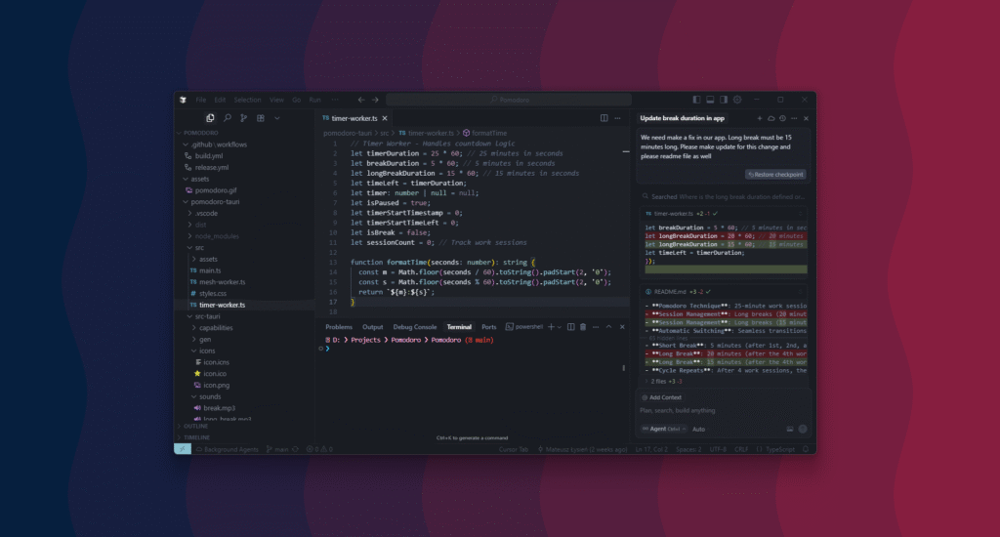
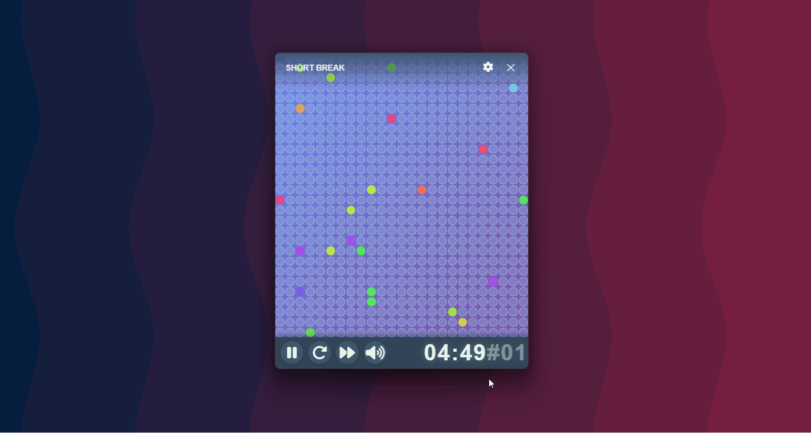

Tematy związane ze sztuczną inteligencją są teraz tak popularne jak Adam Małysz w sezonie 2000/2001 po zwycięstwie w Turnieju Czterech Skoczni oraz Pucharze Świata - cały świat o tym mówi.

Jako że pracuję na co dzień jako programista to temat AI jest mi bardzo bliski. W pracy korzystam z narzędzi wspieranych przez AI, głównie z Copilota. Prywatnie wyszukiwarkę Google zastąpił mi ChatGPT. Takie czasy.

Ostatnio moją uwagę przykuło kolejne narzędzie oparte na AI – **Cursor**. Wykorzystałem okres próbny na plan Pro, zrobiłem prostą ale przydatną aplikację i w tym artykule chciałbym podzielić się wrażeniami z pracy z wykorzystaniem Cursora. Zapraszam do lektury.

## Cursor - co to jest?

Cursor to narzędzie programistyczne wspierane przez sztuczną inteligencję. Mało tego, to całe środowisko programistyczne oparte na Visual Studio Code, którego głównym celem jest jak sami twórcy wskazują - tworzenie oprogramowania szybciej.

To, co wyróżnia Cursora, to głęboka integracja z modelem AI – od edycji kodu, generowanie commitów, przez wykonywanie poleceń w terminalu po sugerowanie zmian. Jest to narzędzie, które nie tyle co uzupełnia kod ale próbuje programować razem z programistą.

**Najważniejsze funkcje Cursora:**

- **Tryb Agenta**  
    Tryb pracy Cursora, w którym wykonuje nasze polecenia na bieżąco analizując kod, pokazując przy tym swój tok myślenia i postęp prac. Ten tryb pozwala na automatyczne wdrażanie bardziej złożonych modyfikacji w projekcie. Zmiany wprowadzane są globalnie, często modyfikuje przy tym kilka plików jednocześnie.

- **Działa w kontekście całego projektu**  
    Cursor analizuje cały kod źródłowy, dzięki czemu rozumie strukturę kodu i zależności między plikami. Dzięki czemu może odpowiadać na pytania dotyczące działania aplikacji. Można go traktować ja interaktywną dokumentację kodu.

- **Obsługa terminala**  
    Potrafi wykonywać polecenia terminalowe – może zbudować aplikację, odpalić serwer, zrobić `git commit` i `push`, przygotować wersję produkcyjną czy zainstalować zależności. Wszystko to można zlecić przy pomocy prostych poleceń w języku naturalnym.

- **Analizowanie grafiki**  
    Cursor może przeanalizować przesłany mu screenshot i na podstawie polecenia może wykonać potrzebne poprawki w kodzie. Na przykład: można przesłać screenshot przycisku i napisać: _"Zmień padding wewnątrz tego przycisku, bo wygląda zbyt ciasno"_ – Cursor zidentyfikuje odpowiedni fragment i zaproponuje poprawkę.

Więcej informacji znajduje się na [stronie internetowej](https://cursor.com/) Cursora.

## Cursor w praktyce

Chcąc sprawdzić jak pracować z Cursorem miałem do wyboru dwie ścieżki:

- **Utworzenie nowej aplikacji** – pozwoliłoby to sprawdzić, jak Cursor radzi sobie z projektowaniem struktury i budowaniem aplikacji od podstaw. Idealne, by przetestować cały proces tworzenia aplikacji od pierwszych linijek kodu aż do wdrożenia.  
    

- **Wykorzystanie Cursora w istniejącej aplikacji -** dzięki czemu można sprawdzić, jak dobrze narzędzie rozumie już napisany kod i jak skutecznie potrafi wprowadzać nowe funkcjonalności, testy czy refaktoryzację.

Wybrałem pierwszą opcję. Interesowało mnie, na ile się dogadamy – czyli czy moje polecenia będą prowadzić do oczekiwanych efektów. Przy okazji zależało mi na stworzeniu czegoś, z czego sam chętnie korzystałbym na co dzień.

### Pomodoro Timer

Jakiś czas temu, [pisałem o technice Pomodoro](https://www.homeverest.pl/technika-pomodoro/) z której korzystam na co dzień. Przez ten czas nic się nie zmieniło – wciąż jej używam i to z dokładnie tą samą aplikacją co wcześniej. Uznałem, że to świetny projekt na zapoznanie się z możliwościami Cursora. Przy okazji w końcu stworzę swój własny Pomodoro Timer.

> Dla przypomnienia - Pomodoro to technika pracy nad zadaniami w której pracujemy (w rzeczywistości staramy się skupić) przez 25 minut, po zakończeniu tego czasu mamy 5 minut przerwy. Po czterech takich cyklach pracy robimy dłuższą przerwę – 15 minut. Oczywiście technikę można dostosować do siebie i dowolnie zmodyfikować czasy trwania przerw oraz czasu pracy.

### Nice to meet you, Cursor

Nie bez powodu ten podtytuł jest po angielsku – co prawda Cursor obsługuje kilka języków naturalnych, ale **polskiego wśród nich nie ma**. Naturalnym wyborem komunikacji staje się więc angielski.

Wracając do aplikacji: pracuję na Windowsie, ale zależało mi na tym, aby projekt był możliwie jak najbardziej **cross-platformowy**. Na samym początku opisałem Cursorowi pomysł aplikacji i poprosiłem o sugestię dotyczącą frameworka, który najlepiej się do tego nada.

Wybór padł na [Tauri](https://v2.tauri.app/) (Rust + TypeScript). I tu już zaczęło się robić ciekawie – bo szczerze mówiąc, wcześniej nawet nie wiedziałem, że taki framework istnieje.

### Ale najpierw kawa setup

Nie od razu Rzym zbudowano a tym bardziej nie od razu zbuduje się aplikację przy pomocy Cursora. Zanim cokolwiek można było zrobić, trzeba było zainstalować wymagane składniki systemu. Cursor zasugerował aby aplikacja była napisana przy pomocy Tauri ale aby mógł zrobić choćby szkielet aplikacji trzeba zainstalować Rust'a i NodeJs'a.

Także… kawka musiała poczekać – najpierw setup.

> Tutaj pojawiła się moja pierwsza myśl, że jednak budowanie aplikacji przy użyciu AI to zadanie mimo wszystko dla ludzi choć trochę technicznych. Zainstalowanie wszystkich zależności w systemie, może dodanie jakichś zmiennych środowiskowych - to brudna robota którą trzeba wykonać aby potem AI mogło nam pomagać przy tworzeniu oprogramowania.

### Cursor – nowy kolega z zespołu

Teraz już można zaopatrzyć się w kawę. Praca z Cursorem przypomina trochę pracę z kolegą z zespołu tylko w takiej trochę jednostronnej relacji - to my mówimy co ma być zrobione a on wykonuje te polecenia przy okazji tłumacząc co zrobił.

Proces tworzenia takiej aplikacji jak Pomodoro Timer jest naprawdę bardzo przyjemny, nie trzeba tłumaczyć zbyt dokładnie logiki biznesowej, bo Cursor już wie ile ma trwać faza skupienia a ile przerwy. Naszym zadaniem jest raczej określenie, jak aplikacja ma wyglądać. Warto mieć choćby ogólny pomysł przed rozpoczęciem pracy.

Współpraca z Cursorem polega na budowaniu aplikacji krok po kroku, element po elemencie. Polecenie w stylu „zbuduj klona Instagrama” raczej nie da dobrego efektu. Ale przy tworzeniu Pomodoro Timera skupiłem się na każdym szczególe – od rozmiaru okienka, po układ przycisków na dolnym pasku. Dzięki temu miałem kontrolę i pewność że to będzie wyglądać i działać tak jak tego oczekuje.

Dużo rzeczy Cursor robi „przy okazji”. Na przykład przy dodawaniu przycisku **Start**, który miał uruchamiać sesję, od razu podpiął logikę timera – nie musiałem go o to dodatkowo prosić. Podobnie było z oknem **Ustawienia** – Cursor sam zbudował formularz ze wszystkimi potrzebnymi opcjami do konfiguracji.

Podtytuł _„Cursor – nowy kolega z zespołu”_ naprawdę dobrze oddaje moje odczucia. Tak jak kolega z zespołu, potrafi czasem coś zepsuć – np. dodając nowy element, przesunąć albo kompletnie „rozjechać” layout. I to zdarzało się kilkukrotnie. Ale kto nigdy nie popsuł czegoś przy dodawaniu nowego feature’a, niech pierwszy rzuci klawiaturą...

Cursor potrafi też zaskoczyć. Nie jestem grafikiem i ciężko mi stworzyć naprawdę ładny interfejs, więc poprosiłem go, aby zmienił kolorystykę aplikacji na bardziej _„modern-aesthetic”_. Po przeładowaniu projektu zbierałem szczękę z podłogi – sam bym tego lepiej nie wymyślił.

Cursor to nie tylko dobry programista, grafik ale też **DevOps**. Pomodoro Timer, który tworzyłem miał być dostępny na różne platformy. Poprosiłem Cursora, aby przygotował cały proces publikowania aplikacji na różne platformy. Utworzył kompletny workflow dla GitHub Actions. Nice. Oczywiście, pojawiły się drobne kłopoty przy pushowaniu zmian do repozytorium, ale wystarczyło podać mu log błędu, a w kolejnym commicie naprawił problem.

Na koniec muszę dodać jedno – najlepiej wraca się do projektu po dłuższej nieobecności. Wpada nowy pomysł, a z Cursorem można go od razu wdrożyć i wypuścić nową wersję. Nie trzeba pamiętać, gdzie i co należy zmienić – a przecież każdy programista zna ten moment, gdy po dłuższej przerwie trzeba na nowo rozkminiać, jak działał kod.

## Co wyniosłem z pracy z Cursorem?

Podsumowując, praca z Cursorem to doświadczenie bardzo zbliżone do pracy z dodatkowym członkiem zespołu. Dobrze wykonuje brudną robotę - programowanie, podsuwa gotowe rozwiązania i zaskakuje kreatywnością. Jednocześnie – jak każdy kolega z zespołu – miewa wpadki i trzeba go czasem skorygować.

Chcąc stworzyć aplikację, która nie wykonuje jakiejś krytycznej dla świata logiki biznesowej czyli po prostu niewielką apkę do użytku własnego - Cursor jest świetnym narzędziem. Pracując z nim czułem się jakbym współpracował z innym programistą.

### Zalety Cursora

Największą zaletą jest to, że pozwala szybciej przejść od pomysłu do działającej funkcjonalności. Zamiast zastanawiać się, jak rozwiązać każdy drobiazg, mogłem skupić się na wizji i wyglądzie aplikacji. To sprawia, że tworzenie staje się lżejsze, bardziej płynne i zwyczajnie przyjemniejsze.

Cursor pozwala też zaoszczędzić mnóstwo czasu, bo nie trzeba uczyć się nowego frameworka czy walczyć z wiecznie nie wycentrowanym divem. W praktyce oznacza to, że w weekend możesz dostarczyć **gotową, estetyczną aplikację**, zamiast spędzać dni na drobiazgach i nauce. Dodatkowo nie trzeba martwić się o dokumentację, bo Cursor może stworzyć bardzo przejrzystą dokumentację i aktualizować ją z każdą zmianą.

### Wady Cursora

Efekt domina - zdarzało się, że dodając feature rozwalał inne już działające elementy. Takie to jakieś ludzkie, nie przystoi AI. Potem trzeba go korygować w celu naprawy błędu przy okazji pamiętając o sprawdzeniu czy to co działało wcześniej dalej działa.

Kilkukrotnie zdarzyło się, że Cursor wprowadzając poprawkę, sam zauważył, że kod się nie kompiluje i wycofał zmianę. Przy kolejnej próbie zrobił dokładnie to samo. Czasami trzeba go nakierować precyzyjniejszym poleceniem – czyli jednak przydaje się podstawowa wiedza programistyczna.

### Czy Cursor zastąpi programistów?

Nie.

> Ale tempo w jakim rozwija się AI może sprawić, że za kilka lat będę się lekko uśmiechał czytając taką odpowiedź.🙂

## Linki:

- Link do pomodoro timera: [https://github.com/mlysien/Pomodoro](https://github.com/mlysien/Pomodoro)
- Strona Cursora: [https://cursor.com/](https://cursor.com/)
