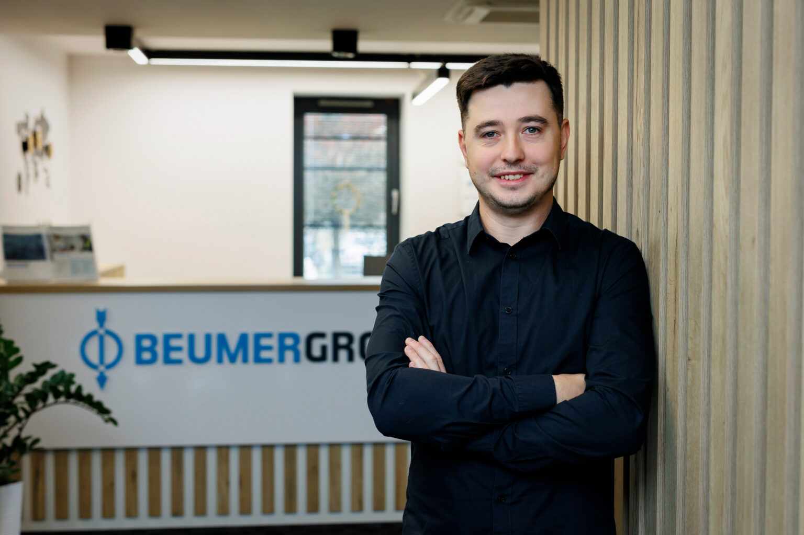

# Hey, I'm Mateusz.

Software developer with roots in .NET, an eye on space, and a habit of building things just to see if I can.

---

## About

I've been writing software professionally for several years, mostly in the Microsoft ecosystem — but I've never been someone who stays in one lane. My journey started with desktop apps in WinForms and WPF, moved into web development with ASP.NET Core and Angular, and in 2023 took an unexpected turn into Kotlin for an international project building pouch sorter technology.

That last shift taught me something I now believe firmly: a programming language is just a tool. What matters is how you think about problems.

> **Long-term goal:** working at ESA and using software to help unravel what the universe is hiding from us. I'm learning Python and diving into AI/ML to get there.

---

## Tech I work with

| Area | Technology |
|------|-----------|
| Primary | .NET / C# |
| Frontend | Angular |
| Backend | ASP.NET Core |
| Also use | Kotlin |
| Learning | Python / ML |
| Degree | M.Eng. 2018 |

---

## Career highlights

### Experience
 
**Software System Engineer** · Feb 2022 – Present  
Joined an international project developing pouch sorter technology. Switched to Kotlin — and actually enjoyed it. The move proved that a programming language is just a tool; what matters is how you think about problems.
 
**Full-Stack .NET Developer** · May 2020 – Jan 2022  
Internal software development and maintenance using ASP.NET Core, Entity Framework Core, ASP.NET MVC, JavaScript, and MS SQL. Working in Scrum with Azure DevOps, Jenkins, and Jira.
 
**.NET Developer** · Mar 2017 – May 2020  
Integrations with ERP systems (Subiekt, Comarch Optima, Comarch XL, Enova 365). Desktop application development using .NET, WinForms, WPF, MVVM Light, REST API, and MS SQL. Applied design patterns and Scrum methodology.
 
**Mobile Developer** · Jul 2015 – Jan 2017  
Mobile application development on the Xamarin platform, primarily Android — building and maintaining apps using .NET, WCF, and Android Studio.

### Education
 
- **2012 – 2016** — B.Eng., Silesian University of Technology, Gliwice
- **2016 – 2018** — M.Eng., Silesian University of Technology, Gliwice

---

## About this blog

Homeverest started as a business card site, became a blog, and now it's where I think out loud about software. Posts range from technical deep-dives to things I picked up on the job. Frequency varies — quality over quantity.

---

## Get in touch

Looking to collaborate or hire? LinkedIn and email are the best ways to reach me.

- [Download CV (PDF)](/mlysien.cv.pl.pdf)
- [GitHub](https://github.com/mlysien)
- [LinkedIn](https://www.linkedin.com/in/mlysien/)
- mateusz.lysien@homeverest.pl
